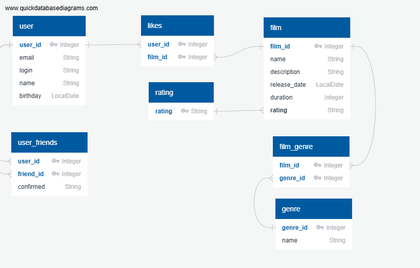

# java-filmorate
Template repository for Filmorate project.

## ER-Диаграмма


## Описание таблиц

### user
Таблица содержит информацию о пользователях приложения:
- `user_id`: Уникальный идентификатор пользователя.
- `email`: Электронная почта пользователя.
- `login`: Логин пользователя.
- `name`: Имя пользователя (если не указано, используется логин).
- `birthday`: Дата рождения пользователя.

### film
Таблица содержит информацию о фильмах:
- `film_id`: Уникальный идентификатор фильма.
- `name`: Название фильма.
- `description`: Описание фильма (до 200 символов).
- `release_date`: Дата выхода фильма.
- `duration`: Продолжительность фильма (в минутах).
- `rating`: наименования рейтингов


### genre
Таблица содержит жанры фильмов:
- `genre_id`: Уникальный идентификатор жанра.
- `name`: Название жанра (например, Комедия, Драма).

### user_friends
Таблица описывает связи между пользователями (дружбу):
- `user_id`: Идентификатор пользователя, часть ключа.
- `friend_id`: Идентификатор друга, часть ключа.
- `confirmed`: boolean, отметка о том, что дружба подтверждена

### likes
Таблица описывает лайки, которые пользователи ставят фильмам:
- `user_id`: Идентификатор пользователя, часть ключа.
- `film_id`: Идентификатор фильма, часть ключа.

### film_genre
Таблица описывает к каким жанрам относится фильм:
- `film_id`: Идентификатор фильма, часть ключа.
- `genre_id`: идентификатор жанра, часть ключа.

### rating
Таблица содержит наименования рейтингов:
- `rating`: Уникальный ключ наименования рейтингов (R, NC_17, PG_13, G, PG).

## Примеры запросов

### 10 самых популярных фильмов
 ```sql
SELECT 
    f.film_id,
    f.name AS film_name,
    COUNT(l.userId) AS likes_count
FROM 
    film f
LEFT JOIN 
    likes l ON f.film_id = l.filmId
GROUP BY 
    f.film_id, f.name
ORDER BY 
    likes_count DESC
LIMIT 10;
```

### Общие с пользователем друзья
-- Найти общих друзей между user1 (например, ID=1) и user2 (например, ID=2)
 ```sql
SELECT 
    u.user_id,
    u.login,
    u.name,
    u.email
FROM 
    user_friends uf1
INNER JOIN 
    user_friends uf2 ON uf1.friend_id = uf2.friend_id
INNER JOIN 
    user u ON uf1.friend_id = u.user_id
WHERE 
    uf1.user_id = 1  -- ID первого пользователя
    AND uf2.user_id = 2  -- ID второго пользователя
    AND uf1.confirmed = TRUE  -- Только подтвержденные друзья (если важно)
    AND uf2.confirmed = TRUE;
```